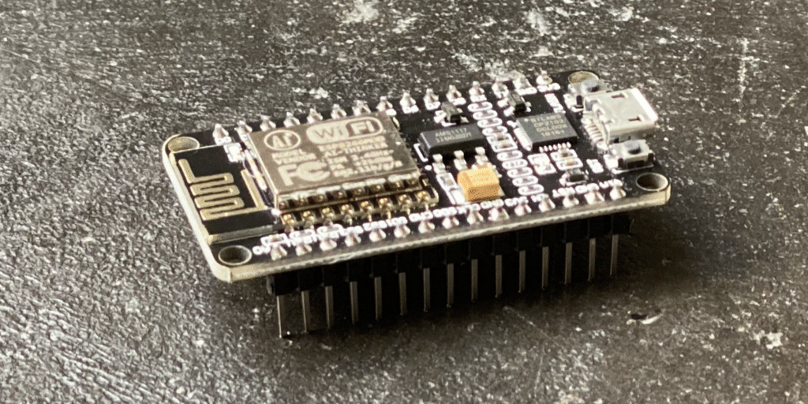
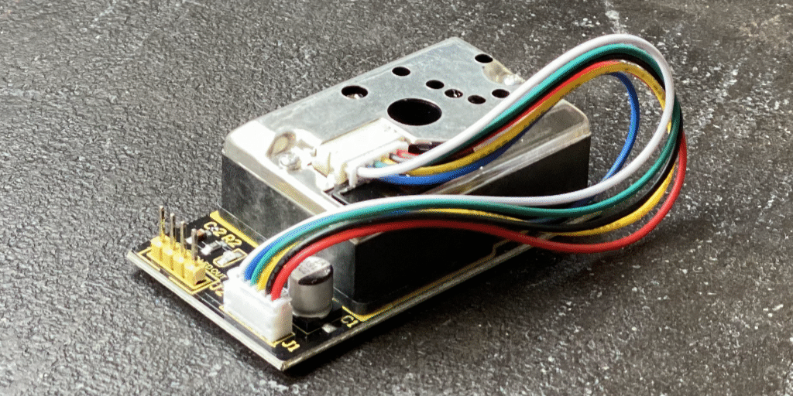
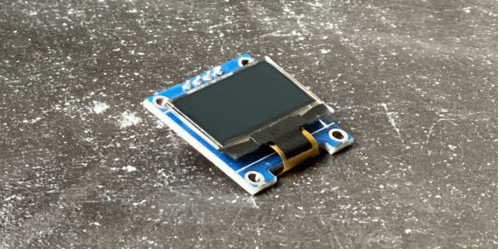
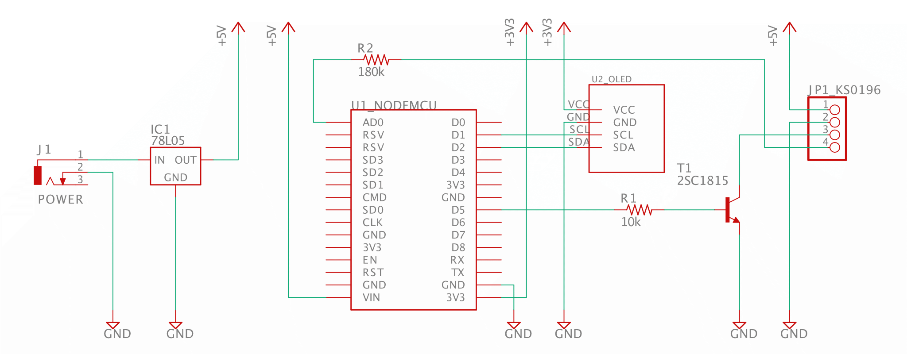

NodeMCU Air Quality Sensor
==========================

A simple sensor node for measuring air quality in your room.

Components
----------

This project is using following major components.

- NodeMCU

  

  [NodeMCU](https://github.com/nodemcu/nodemcu-devkit-v1.0) is an open source SoC board that provides Wi-Fi connectivity.

  It is using [ESP-12E](http://wiki.ai-thinker.com/esp8266) package which is using [ESP8266](https://www.espressif.com/en/products/socs/esp8266) SoC.

  This is a well known component documented a lot on the internet and working with Arduino IDE, so it's easy for building such sensor project.

  You can buy this at very low cost on Amazon, such as [NodeMCU Internet WiFi Development Board](https://amzn.to/2Z9c07V).

- GP2Y1014AU

  

  GP2Y1014AU is an air quality sensor that is detecting small particles using LED and a light sensor.

  It is not documented officially however, you can find a few documentations on the internet such as [this repository](https://github.com/sharpsensoruser/sharp-sensor-demos/wiki/Application-Guide-for-Sharp-GP2Y1014AU0F-Dust-Sensor).

  You can buy this at very low cost on Amazon, such as [Keyestudio PM2.5 Dust Sensor (KS0196)](https://amzn.to/35aWhJ1).

- OLED Display (Optional)

  

  [SSD1306](https://cdn-shop.adafruit.com/datasheets/SSD1306.pdf) is a display driver that is commonly used with a small OLDE display, which we can drive by using I2C.

  You can buy this at very low cost on Amazon, such as [IZOKEE I2C 128X64 Pixel OLED LCD Display](https://amzn.to/320ACRR).

Schematic
---------



### Note

- NodeMCU is driven by 3.3V.
- GP2Y1014AU (KS0196) requires 5V.
- ESP8266 ADC is 0V to 1V range, so NodeMCU AD0 pin has 100K/220K to scale up 0V to 3.3V, and extra 180K required for KS0196 output.
- KS0196 LED is low to activate LED and drain max 30mA current, so using inverter T1 to drive by NodeMCU D5.
- NodeMCU VIN is lower than 5V (about 4.6V) when it's driven by microUSB power, which is not enough for GP2Y1014AU. For normal operation, supply 5V power like using 78L05.

Arduino project
---------------

Open `/nodemcu_air_quality_sensor.ino` project at `/Arduino` directory in [Arduino IDE](https://www.arduino.cc/en/main/software).

### Prerequisite

- CP2102 Kernel Extension or Driver.

  To connect your computer to the NodeMCU, it requires to install kernel extension or driver for [CP2102](https://www.silabs.com/documents/public/data-sheets/CP2102-9.pdf), which NodeMCU is using for USB to serial.

  You can find kernel extension or driver at [CP210x USB to UART Bridge VCP Drivers](https://www.silabs.com/products/development-tools/software/usb-to-uart-bridge-vcp-drivers).

  To build the project, it requires extra libraries and board components.

- NodeMCU Arduino Core

  Set `https://arduino.esp8266.com/stable/package_esp8266com_index.json` to the Board Manager URLs and use Board Manager to install ESP8266 Boards.

  See [ESP8266 Arduino Core documentation](https://arduino-esp8266.readthedocs.io/en/latest/installing.html) for the details.

- Adafruit SSD1306 library (Optional)

  Use Library Manager and install Adafruit SSD1306. This is optional for using OLED Display.

### Build

Adjust `#define` flags at the top for your setup.

- `READ_MODE` to `1` for just testing sensor without Wi-Fi integration.
  This is mutually exclusive with `WIFI_SERVER_MODE`.
- `WIFI_SERVER_MODE` to `1` for make it works on Wi-Fi.
  This is mutually exclusive with `READ_MODE`.
- `USE_DISPLAY` to `1` if you use OLDE Display for the output.
- `USE_SERIAL` to `1` if you use serial output on Serial Monitor in Arduino IDE for debugging.

Usage
-----

Wth `WIFI_SERVER_MODE`, once it is loaded and running, you will see the IP address that is assigned to the NodeMCU.

Use such as `curl` to see the result.

```
curl -v 'http://$IP_ADDRESS/metrics'
```

Prometheus
----------

The output format from `/metrics` is for [Prometheus](https://prometheus.io/) scraping.

You can add a following scrape config in your `prometheus.yml` to scrape it.

```
scrape_configs:
  - job_name: nodemcu_ks0196
    static_configs:
    - targets:
      - $IP_ADDRESS:80
```
